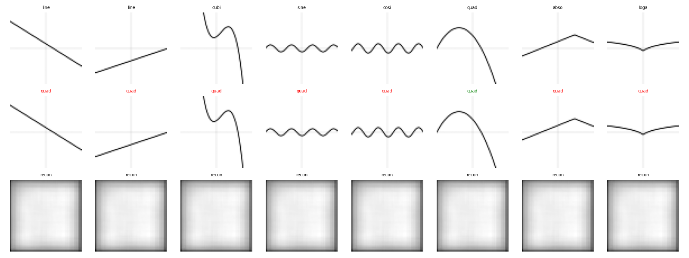
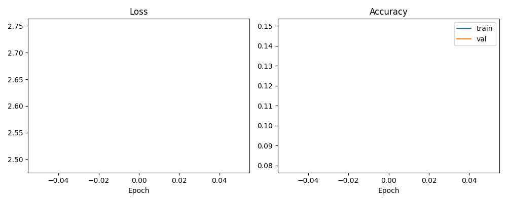

# FunctionCNN

[](https://github.com/raahimnawaz/func_class_-cnn/actions/workflows/ci.yml)
[](https://www.python.org/)
[](https://pytorch.org/)
[](LICENSE)

A multi-task convolutional neural network that takes a **rendered plot of a mathematical function** and simultaneously:

- **Classifies** it into one of 16 function families (8 two-dimensional curves, 8 three-dimensional surfaces)
- **Detects** up to 9 binary structural properties — periodic, monotone, bounded, symmetric, saddle point, and more
- **Reconstructs** the input plot as an auxiliary self-supervised task that regularises the shared representation

The backbone is a five-block **ResNet with Squeeze-and-Excitation channel attention**, trained end-to-end on synthetically generated 128×128 grayscale images. The dataset is effectively infinite — every sample is freshly randomised at generation time, so the model never sees the same plot twice.

---


*Row 1: input plot — Row 2: predicted class (green = correct, red = wrong) — Row 3: decoder reconstruction from the shared latent*

---

## Contents

- [Features](#features)
- [Architecture](#architecture)
- [Dataset](#dataset)
- [Installation](#installation)
- [Quick Start](#quick-start)
- [Training](#training)
- [Gradio Demo](#gradio-demo)
- [Tests](#tests)
- [Design Decisions](#design-decisions)
- [Repo Layout](#repo-layout)
- [Results](#results)
- [Contributing](#contributing)
- [License](#license)

---

## Features

- 16-class function classifier spanning 2D curves and 3D surfaces from a single 128×128 grayscale image
- 9-dimensional binary property detector encoding interpretable structural attributes
- Auxiliary convolutional decoder for self-supervised regularisation
- ResNet-style backbone with Squeeze-and-Excitation channel attention
- Mixed-precision training (`torch.amp`) for ~2× throughput on CUDA with no accuracy loss
- Cosine LR schedule + AdamW — no per-run hyperparameter tuning required
- Fully synthetic, infinitely scalable dataset
- Interactive Gradio web demo: sketch a curve, get a prediction
- GitHub Actions CI: Ruff linting + Pytest on every push and pull request

---

## Architecture

```
              input  (1 × 128 × 128)
                     │
                     ▼
        ┌─────────────────────────────┐
        │   Backbone (5 residual      │  128 → 64 → 32 → 16 → 8 → 4
        │   blocks, BN + SE attention)│
        └─────────────┬───────────────┘
                      │
              AdaptiveAvgPool2d(1)
                      │
                      ▼
        ┌─────────────────────────────┐
        │     Shared FC trunk         │  512 → 512 → 256
        └─┬───────────┬───────────┬───┘
          │           │           │
          ▼           ▼           ▼
     ┌────────┐  ┌──────────┐ ┌──────────┐
     │Classify│  │ Detector │ │ Decoder  │
     │ 16-way │  │ 9 sigm.  │ │ recon img│
     └────────┘  └──────────┘ └──────────┘
```

Each `ResConvBlock`:

```
x ──► Conv3×3 ─ BN ─ ReLU ─ Conv3×3 ─ BN ─┐
 │                                        ▼
 └──► 1×1 skip ──────────────────────► (+) ─ SE attention ─ ReLU ─ MaxPool ─ Dropout
```

**Training objective:**

```
L = CE(class) + 0.5 · BCE(properties) + 0.3 · MSE(reconstruction)
```

Dropout rates are graduated (0.05 → 0.25) through the backbone blocks; the shared FC trunk adds a further 0.4 / 0.3 pair to regularise the dense bottleneck.

---

## Dataset

Every sample is generated on-the-fly from one of 16 parametrically randomised function families:

| Dimension | Function families |
|-----------|-------------------|
| **2D** | linear, quadratic, cubic, sine, cosine, exponential, logarithmic, absolute |
| **3D** | paraboloid, saddle, sine surface, gaussian, ripple, cone, hyperboloid, spiral surface |

2D functions are plotted as blue curves on a white 128×128 canvas. 3D surfaces are rendered with a randomly sampled viewpoint using Matplotlib's `plot_surface`. Colour is discarded — only luminance is retained.

Each image is labelled with:
- A **class index** (0–15) drawn from the function-type taxonomy above
- A **9-dimensional binary feature vector** encoding structural properties:

| Index | Property |
|-------|----------|
| 0 | `is_periodic` |
| 1 | `is_monotone_increasing` |
| 2 | `is_monotone_decreasing` |
| 3 | `has_multiple_peaks` |
| 4 | `is_bounded_above` |
| 5 | `is_bounded_below` |
| 6 | `is_3d` |
| 7 | `is_symmetric` |
| 8 | `has_saddle_point` |

Default split: **8,000 training samples** and **1,600 validation samples** (configurable via `NUM_TRAIN` / `NUM_VAL` in `src/train.py`).

---

## Installation

Requires **Python ≥ 3.9** and **PyTorch ≥ 2.1**.

```bash
# Full install — editable, with dev tools and Gradio demo
pip install -e ".[dev,demo]"

# Runtime only — no dev tools, no Gradio
pip install -r requirements.txt
```

For GPU-accelerated training, install a CUDA-enabled PyTorch wheel separately (see [pytorch.org/get-started](https://pytorch.org/get-started/locally/)). Mixed precision is enabled automatically when CUDA is available.

---

## Quick Start

```bash
# Train the full model
# Writes: function_cnn.pth, training_curves.png, predictions.png
python -m src.train

# Train the 1-layer baseline only
python -m src.train --baseline

# Train both models and print a side-by-side accuracy comparison
python -m src.train --compare

# Override epoch count for either mode
python -m src.train --epochs 50
python -m src.train --compare --epochs 20
```

The package also installs a console entry-point:

```bash
function-cnn-train
function-cnn-train --compare --epochs 50
```

---

## Training

| Hyperparameter | Default |
|----------------|---------|
| Optimiser | AdamW |
| Learning rate | 5 × 10⁻⁴ |
| Weight decay | 1 × 10⁻³ |
| LR schedule | CosineAnnealingLR |
| Batch size | 64 |
| Epochs (full model) | 30 |
| Mixed precision | Automatic on CUDA |
| DataLoader workers | `min(cpu_count, 8)` |

The best checkpoint (by validation accuracy) is saved to `function_cnn.pth` during training. Training curves are written to `training_curves.png` at the end of each full or compare run:



---

## Gradio Demo

```bash
python gradio_demo.py
```

Open the local URL printed to the terminal. Sketch any 2D curve on the canvas and click **Predict**. The model returns:

- **Top-5 function-type probabilities** as a bar chart
- **Detected structural properties** (threshold: 0.5)

The demo requires trained weights at `function_cnn.pth`. If the file is missing, run `python -m src.train` first.

---

## Tests

```bash
pytest        # run all tests
pytest -v     # verbose output with per-test status
```

| File | Coverage |
|------|----------|
| `tests/test_dataset.py` | Generator output shapes, pixel range [0, 1], feature vector bounds |
| `tests/test_model.py` | Forward-pass output shapes for both models, parameter-count sanity |

Tests are CPU-only and complete in a few seconds. They run automatically on every push and pull request via GitHub Actions.

---

## Design Decisions

**Residual connections** — Without skip connections, a 10-layer CNN over small (128 px) images is hard to optimise. The residual path keeps gradients flowing and lets deeper blocks specialise without degrading early features.

**Squeeze-and-Excitation attention** — Different function families activate different feature channels: a wave's repeating ridges versus a parabola's smooth bowl. SE blocks let the network reweight channels per-example at negligible parameter cost.

**Multi-task learning** — The property detector forces the shared latent space to encode *interpretable* structural attributes. The decoder forces it to retain *geometric* information. Both auxiliaries reduce overfitting and amplify the supervision signal from a single class label.

**Graduated dropout** — Dropout rates increase from 0.05 in the first backbone block to 0.25 in the fifth, and reach 0.4 in the shared FC trunk. This concentrates regularisation where the network is widest and the risk of co-adaptation is highest.

**Synthetic data** — Every sample is freshly randomised at generation time, making the effective dataset size unlimited. The model never memorises specific plots, and the generation cost is paid once per epoch.

**Mixed precision (AMP)** — Achieves ~2× training throughput on modern NVIDIA GPUs. BatchNorm and residual paths absorb fp16 numerical noise well, so accuracy is unaffected.

**Cosine LR schedule + AdamW** — Robust defaults that do not require per-experiment tuning. Cosine annealing prevents the large-LR overshoot that costs the final few percent of accuracy at the end of training.

---

## Repo Layout

```
.
├── README.md
├── RESULTS.md                    # pinned benchmark numbers and training log
├── LICENSE                       # MIT
├── pyproject.toml                # pip install -e ".[dev,demo]"
├── requirements.txt              # runtime dependencies
├── requirements-dev.txt          # dev and test dependencies
├── .github/
│   └── workflows/ci.yml          # Ruff lint + Pytest on push / PR
├── function_cnn.py               # backwards-compatibility shim → re-exports from src/
├── function_cnn.ipynb            # interactive notebook and demo
├── gradio_demo.py                # Gradio sketch-a-curve web demo
├── training_curves.png           # generated by src.train
├── predictions.png               # generated by src.train
├── src/
│   ├── __init__.py
│   ├── data.py                   # function generators and FunctionDataset
│   ├── model.py                  # FunctionCNN, BaselineCNN, SEBlock, ResConvBlock
│   └── train.py                  # training loop, evaluation, visualisation, CLI
└── tests/
    ├── test_dataset.py           # generator and dataset shape and range checks
    └── test_model.py             # forward-pass shapes and parameter-count sanity
```

Trained weights (`function_cnn.pth`, `baseline_cnn.pth`) are not checked in. Regenerate with:

```bash
python -m src.train           # full model only
python -m src.train --compare # full model + baseline, side-by-side
```

---

## Results

See [RESULTS.md](RESULTS.md) for pinned benchmark numbers tied to a specific commit, hardware details, and a full training log.

| Model | Parameters | Best val accuracy (16-class) |
|-------|-----------|------------------------------|
| Baseline (1 conv + linear) | ~17 K | see [RESULTS.md](RESULTS.md) |
| FunctionCNN (ResNet + SE + multi-task) | ~10 M | see [RESULTS.md](RESULTS.md) |

Reproduce the comparison with:

```bash
python -m src.train --compare
```

---

## Contributing

Contributions are welcome. To get started:

1. Fork the repository and create a feature branch
2. Install the dev extras: `pip install -e ".[dev]"`
3. Verify your changes pass linting and tests: `ruff check src tests && pytest`
4. Open a pull request with a clear description of what changed and why

---

## License

[MIT](LICENSE) © Raahim Nawaz
