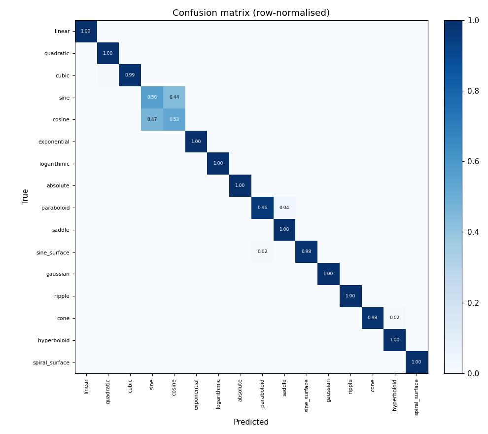
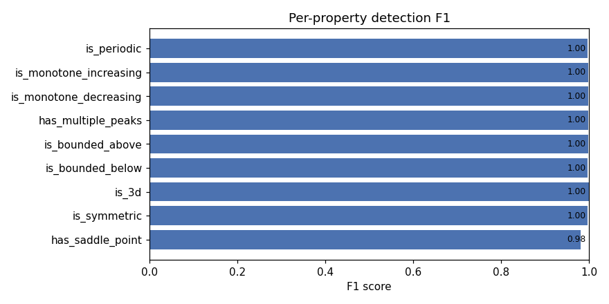

# Results

Pinned benchmark from a seeded `--compare` run. The default seed (42) makes the
dataset draw and the optimisation trajectory reproducible, so re-running
`python -m src.train --compare` on comparable hardware reproduces these numbers
to within GPU-nondeterminism noise (~0.5 pp).

---

## How to reproduce

```bash
pip install -e ".[dev]"
python -m src.train --compare          # seed defaults to 42
```

The run writes a per-epoch log, the `=== Baseline vs Full ===` summary,
`metrics.json`, and four figures under `figures/`.

---

## Reference Run

| Field | Value |
|-------|-------|
| Commit | `d6c4b96` (+ eval/seed changes in this commit) |
| Date | 2026-07-23 |
| Hardware | NVIDIA GeForce GTX 980 Ti (Maxwell, 6 GB) |
| PyTorch | 2.5.1+cu121, fp32 (AMP auto-disabled — Maxwell has no tensor cores) |
| Training samples | 8,000 |
| Validation samples | 1,600 |
| Epochs | 30 (full model) / 30 (baseline) |
| Batch size | 64 |
| Optimiser | AdamW — lr=5e-4, weight_decay=1e-3 |
| LR schedule | CosineAnnealingLR |
| Random seed | 42 |

---

## Benchmark

| Model | Parameters | Best val accuracy (16-class) |
|-------|-----------|------------------------------|
| Baseline (1 conv + linear) | ~17 K | 64.2 % |
| FunctionCNN (ResNet + SE + multi-task) | 11.3 M | **93.8 %** |
| Gain | — | **+29.5 pp** |

### Full-model metrics (validation)

| Metric | Value |
|--------|-------|
| 16-class accuracy | **93.8 %** |
| &nbsp;&nbsp;→ 2D curves | 88.5 % |
| &nbsp;&nbsp;→ 3D surfaces | 99.0 % |
| Property detection — macro-F1 (9 labels) | **0.996** |
| Property detection — Hamming accuracy | 99.8 % |
| Property detection — exact-match (all 9 correct) | 99.1 % |

### Per-class accuracy — where the error actually lives

Fifteen of sixteen classes land at **96–100 %**. Almost the entire error budget
is a single, *expected* confusion: **sine (56 %) ↔ cosine (53 %)**. A sine with a
phase offset is a cosine (`sin(x + π/2) = cos(x)`), and the generators draw a
uniform random phase for both — so the two families overlap by construction and
the model cannot separate them from geometry alone. This is the honest ceiling of
the task, not a training failure, and it is what drags the 2D number below the 3D
one.

**How to lift it.** The overlap is a data-generation artifact, so the fix is in the
generator, not the model. Either (a) constrain the phase so the two families occupy
disjoint offset ranges (e.g. draw sine near phase 0 and cosine near π/2 instead of a
full random `c ∈ [0, 2π)`), which makes them separable again; or (b) collapse sine
and cosine into a single `sinusoid` class and add the **phase offset as a continuous
regression target** — turning an unwinnable classification into a well-posed one plus
a parameter the model can actually recover. Option (b) is the more honest framing of
the underlying function.

| Class | Acc | | Class | Acc |
|-------|----:|-|-------|----:|
| linear | 100 % | | paraboloid | 96 % |
| quadratic | 100 % | | saddle | 100 % |
| cubic | 99 % | | sine_surface | 98 % |
| **sine** | **56 %** | | gaussian | 100 % |
| **cosine** | **53 %** | | ripple | 100 % |
| exponential | 100 % | | cone | 98 % |
| logarithmic | 100 % | | hyperboloid | 100 % |
| absolute | 100 % | | spiral_surface | 100 % |





---

## Training Log

```
[baseline][ 1/30] loss=2.8333 train=20.5% val=32.4%
[baseline][ 2/30] loss=2.2375 train=33.7% val=40.4%
...
[baseline][30/30] loss=1.0451 train=67.4% val=64.2%
[baseline] best val acc: 64.2%

[full][ 1/30] loss=1.7950 train=35.6% val=52.6%
[full][ 5/30] loss=0.3977 train=84.4% val=87.0%
[full][10/30] loss=0.2006 train=91.2% val=91.7%
[full][20/30] loss=0.1252 train=93.2% val=93.7%
[full][30/30] loss=0.1120 train=93.5% val=93.6%
[full] best val acc: 93.8%

====================================================
  FULL-MODEL METRICS (validation)
====================================================
  16-class accuracy        : 93.8%
    2D curves              : 88.5%
    3D surfaces            : 99.0%
  Property macro-F1        : 0.996
  Property Hamming acc     : 99.8%
  Property exact-match     : 99.1%

=== Baseline vs Full ===
  Baseline (1-conv layer)        : 64.2%
  Full ResNet+SE+multi-task      : 93.8%
  Gain                           : +29.5 pp
```

Full metrics (including the 16×16 confusion matrix) are written to
[`metrics.json`](metrics.json) on every run.

---

## Notes

- AMP (mixed precision) is enabled automatically only on GPUs with tensor cores
  (compute capability ≥ 7.0, i.e. Volta and newer). On the Maxwell GTX 980 Ti
  used here it correctly falls back to fp32, since fp16 throughput on Maxwell is
  a fraction of fp32. CPU runs are roughly 10× slower but produce comparable
  final accuracy.
- The reconstruction loss (`MSE`) serves as a regulariser only and is not
  reported as a standalone metric.
- Figures under `figures/` and `metrics.json` are committed outputs from this
  reference run; re-running `--compare` overwrites them with your run's results.
